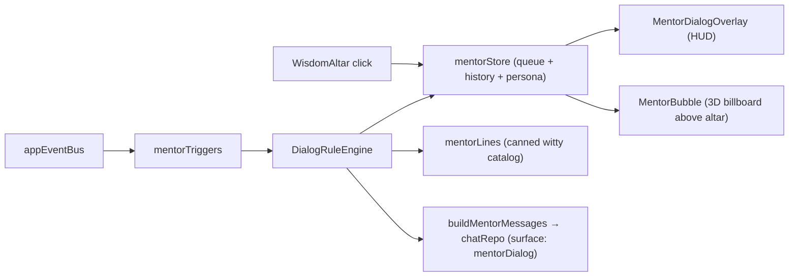

# 🎙️ Witty Mentor — Wisdom Altar Dialog System

Turn the **Wisdom Altar** from a passive monument into an in-world **mentor/coach** with an interactive, skippable dialog system that delivers Portal-2 / Stanley-Parable-style witty cheer-ups, contextual hints, and onboarding guidance.

## 🎯 Goals

- Treat the Wisdom Altar as a character, not just a UI button.
- Ship a reusable dialog framework (rules, triggers, queue, cooldowns).
- Always interactive, always skippable, never blocks a study card without consent.
- Onboard new players with a warm name-asking welcome → nudge them to create their first subject.
- Default mentor voice: **Witty & sarcastic mentor**, drawn from the existing `AGENT_PERSONALITY_OPTIONS` catalog in `src/features/studyPanel/agentPersonalityPresets.ts`. The mentor inherits the player's `studySettingsStore.agentPersonality` — no separate persona setting.

## 🧱 Architecture overview



### New modules

| Path | Purpose |
| --- | --- |
| `src/features/mentor/mentorStore.ts` | Zustand store: `playerName`, `dialogQueue`, `currentDialog`, `seenTriggers`, `cooldowns`, `muted`, `lastInteractionAt`. Persona is read from `studySettingsStore.agentPersonality` rather than duplicated. |
| `src/features/mentor/dialogRuleEngine.ts` | Pure module: evaluates trigger payloads → produces `DialogPlan` (canned line, LLM-line, or scripted multi-step) |
| `src/features/mentor/mentorTriggers.ts` | Pure registration helpers; mentor subscribers live inside `src/infrastructure/eventBusHandlers.ts` under the existing `__abyssEventBusHandlersRegistered` guard. Calls the engine and pushes plans into the store. No idle timer. |
| `src/features/mentor/mentorLines.ts` | Hand-authored canned lines (Portal/Stanley register) keyed by trigger + bucket |
| `src/features/mentor/buildMentorMessages.ts` | Templates `witty-mentor.prompt` with player stats + trigger context |
| `src/components/MentorDialogOverlay.tsx` | Bottom-anchored interactive dialog card (typewriter, skip, choices, name input) |
| `src/components/MentorBubble.tsx` | 3D billboard above the altar with mood glyph (`💭`, `❗`, `…`, `🎉`); also acts as the **only** mentor click target — opens the dialog overlay (`mentor.bubble.click`). |

### Files to modify

- `src/components/WisdomAltar.tsx` — **leave existing click → Discovery flow untouched**. Parent the new `MentorBubble` next to the altar's existing `Sparkles` Billboard. The bubble is the only mentor click target; the altar itself does **not** open the mentor.
- `src/components/DiscoveryModal.tsx` — extend the existing `Empty` block: when `subjects.length === 0`, render an onboarding empty-state with title **"Create your first subject"** and a primary `Button` whose `onClick` calls a new optional `onCreateSubject?: () => void` prop. Preserve today's "No topics match / Reset filters" copy for the `subjects.length > 0 && displayTiers.length === 0` branch.
- `src/components/StudyGraphPageClient.tsx` — pass the existing `() => setIsIncrementalSubjectOpen(true)` handler (already used for `SubjectNavigationHud`'s `NEW_SUBJECT_VALUE`) into `DiscoveryModal` as `onCreateSubject`. The Discovery empty-state CTA reuses the same `IncrementalSubjectModal` flow with no new global state.
- `src/infrastructure/eventBus.ts` — add `mentor:*` events.
- `src/infrastructure/eventBusHandlers.ts` — **register all mentor trigger subscribers here**, alongside the existing telemetry/toast handlers, under the existing `__abyssEventBusHandlersRegistered` global guard. There is **no** separate `MentorTriggersMount` component.
- `src/types/llmInference.ts` — add `mentorDialog` to `InferenceSurfaceId`, `ALL_SURFACE_IDS`, and `SURFACE_DISPLAY_LABELS`.
- `src/infrastructure/openRouterDefaults.ts` — bind `mentorDialog` to `STUDY_SURFACE_DEFAULT_MODEL` (`google/gemma-4-26b-a4b-it:free`, Gemma 26B free tier) via `buildDefaultSurfaceBindings`.
- `src/store/studySettingsStore.ts` — add the `mentorDialog` surface binding to `surfaceProviders`. **Mentor reuses the existing `agentPersonality` field** — no new persona setting.
- `src/store/uiStore.ts` — `isMentorDialogOpen` flag (so `selectIsAnyModalOpen` knows about it; mentor must NOT block scene clicks the way modals do — see *Interaction rules*). The mentor's `open_discovery` effect calls the existing `openDiscoveryModal()` action; no new `uiStore` actions are required.
- `src/components/settings/GlobalSettingsSheet.tsx` — add a single **mute mentor** toggle to `PreferencesSection` (muted by default, mirroring the `featureFlagsStore` pattern). No per-mentor TTS switch.
- `app/layout.tsx` — mount only `<MentorDialogOverlay/>`. **No** `<MentorTriggersMount/>` (subscribers are registered inside `eventBusHandlers.ts`).
- `src/features/telemetry/types.ts` — add zod schemas for `mentor_dialog_shown`, `mentor_dialog_skipped`, `mentor_dialog_completed`, `mentor_choice_selected`, `mentor_onboarding_completed` to `TelemetryEventTypeSchema` and `TelemetryEventMap`. Every event carries `source: 'canned'|'llm'`.
- `src/prompts/witty-mentor.prompt` — accept `playerName`, `trigger`, `stats`, `persona` interpolations; restrict output to one short paragraph (≤ 2 sentences). `personality` slot is filled from `getAgentPersonalityInstructions(agentPersonality)`.

## 💬 Dialog data model

```tsx
type MentorMessage = {
  id: string;
  text: string;                 // markdown allowed (small subset)
  mood?: 'neutral' | 'cheer' | 'tease' | 'concern' | 'celebrate' | 'hint';
  delayMs?: number;             // typewriter speed override
  choices?: MentorChoice[];     // mutually exclusive with input
  input?: { kind: 'name'; placeholder?: string; maxLen?: number };
  autoAdvanceMs?: number;       // 0/undefined = require user action
};

type MentorChoice = {
  id: string;
  label: string;
  next?: 'end' | string;        // goto next message id
  effect?: MentorEffect;        // e.g. { kind: 'open_discovery' }
};

type DialogPlan = {
  id: string;
  trigger: MentorTriggerId;
  priority: number;             // higher pre-empts lower in queue
  messages: MentorMessage[];
  source: 'canned' | 'llm';
  cooldownMs?: number;
  oneShot?: boolean;            // mark trigger as seen on completion
};
```

## 🪝 Triggers (rules + selection)

| Trigger id | Source | When | Cooldown | Priority | Source of lines |
| --- | --- | --- | --- | --- | --- |
| `onboarding.welcome` | mount + `playerName==null` | First mount, no name | one-shot | 100 | scripted (3-msg flow with name input) |
| `onboarding.first_subject` | `playerName!=null` & `subjects.length==0` | After welcome | one-shot | 95 | scripted |
| `session.completed` | event bus | Session ends | per-session | 60 | LLM (summary cheer) |
| `crystal.leveled` | event bus | Level up | 60 s | 70 | canned (celebrate) |
| `crystal.trial.awaiting` | trial store | XP capped, trial ready | one-shot per cycle | 75 | canned (tease) |
| `mentor.bubble.click` | user clicks the **MentorBubble** billboard above the altar | manual | none | 90 | canned (idle/contextual); LLM only when stats meaningfully change the line |

### Out of scope (v1)

The following triggers were considered and **explicitly dropped** for v1; revisit only with hard data showing they don't trip annoyance-creep:

- `idle.long` — no clear benefit from idle prodding; the persistent bubble already signals presence.
- `ritual.ready` — already surfaced by the altar's own ritual-glow / `Sparkles` Billboard.
- `card.streak.correct`, `card.streak.wrong`, `card.hint_offer` — interrupting active study is the highest-risk path; the existing hint UI is left untouched.
- `subjectGraph.generated`, `topic.unlocked` — covered by the in-scene VFX/toasts already wired in `eventBusHandlers.ts`.

### Selection rules

1. Engine builds candidate `DialogPlan`s; only the highest-priority non-cooldown plan reaches the queue.
2. **Strict FIFO with priority sort on enqueue** — no pre-emption, no confirm-skip. Higher-priority plans jump ahead in the queue but never interrupt the message currently on screen.
3. Same `triggerId` re-fires only after its `cooldownMs`.
4. `oneShot` triggers persist in `seenTriggers` (localStorage).
5. Never trigger during an active study reveal animation; defer until reveal complete.
6. **Most-important-triggers filter** — when `muted=true` (default), only plans with `priority ≥ 70` reach the HUD: `onboarding.*` (100/95), `mentor.bubble.click` (90, always allowed as manual user intent), `crystal.trial.awaiting` (75), `crystal.leveled` (70). `session.completed` (60) is suppressed while muted.

## 🎬 Onboarding flow (reference script)

1. **Welcome** — *"Oh. A new test subject. Hello. I'm contractually required to be encouraging. Let's get this over with — pleasantly."*
2. **Ask name** — input field, max 24 chars, validates non-empty. *"Before I file your paperwork, what should I call you?"*
3. **Confirm** — *"`{name}`. A perfectly serviceable name. We'll use it sparingly so it stays special."*
4. **Next step** — choice buttons:
    - **"Create my first subject"** → effect `open_discovery` → calls existing `uiStore.openDiscoveryModal()`. The Discovery Modal then surfaces its new empty-state CTA (see below) which routes the player into `IncrementalSubjectModal`.
    - **"Maybe later"** → closes the dialog. The persistent `MentorBubble` keeps `onboarding.first_subject` queued so the player can re-enter from the altar at any time. **No idle reminder is scheduled** (idle prodding is out of scope).
5. Marks `seenTriggers: ['onboarding.welcome','onboarding.first_subject']` on completion.
6. **Name reuse policy** — never in routine cheers; only on **special moments**: first subject created, level-up, trial passed, high-streak session summary, returning after a long break.
7. **Skippable name input** — a **Skip** choice keeps `playerName=null`; mentor falls back to generic forms ("you", "test subject"). Onboarding still completes and `seenTriggers` is marked.

### Discovery Modal empty-state CTA (wiring)

`DiscoveryModal` already renders an `Empty` block (`EmptyHeader` / `EmptyTitle` / `EmptyDescription` / `EmptyContent`) when `displayTiers.length === 0`. Split that branch in two:

- **Branch A — no subjects yet** (`subjects.length === 0`, the onboarding case): `EmptyTitle` "Create your first subject", `EmptyDescription` mirrors the welcome copy, `EmptyContent` renders a primary `Button` whose `onClick` calls `props.onCreateSubject?.()`. Wire that prop from `StudyGraphPageClient`'s existing `setIsIncrementalSubjectOpen(true)` handler — the same one already fed to `SubjectNavigationHud` for `NEW_SUBJECT_VALUE`. No new `uiStore` actions, no new global state.
- **Branch B — subjects exist but no matches** (today's behaviour): keep the existing "No topics match / Reset filters" copy unchanged.
- The mentor's `open_discovery` effect simply calls `openDiscoveryModal()`; the empty-state CTA does the rest. Discovery stays the single entry point for "create a subject" while the mentor merely points the player at it. The CTA is also visible to any user with no subjects — not gated on the mentor onboarding flow.

## 🎨 UI / interaction rules

- **Skippable**: click/tap, `Space`, `Enter` → reveal full text; second action → advance.
- **Dismissable**: `Esc` or close button → ends current dialog, keeps queue intact.
- **Non-blocking**: overlay sits above HUD but does NOT take over the scene; pointer-events on chrome only.
- **Anchoring**: bottom-center HUD card on mobile; bottom-left card with a tail pointing at the altar on desktop.
- **Bubble (the only click target)**: small 3D billboard above the altar mirrors current mood while overlay is closed; pulses on new queued plan; click opens the overlay (`mentor.bubble.click`). The altar itself keeps its existing Discovery Modal click — **no new altar context menu, no "if mood, click altar" override, no separate `MentorHotspot`**.
- **HUD persistence**: HUD card **persists until the user dismisses it** (no auto-hide). The queue survives dismissal so subsequent triggers can still surface.
- **TTS**: **inherits the master `useInferenceTtsToggle`** (`abyss:tts-toggle`, off by default). **No per-mentor TTS switch** in the dialog header. Reuse `useLlmAssistantSpeech` for streamed LLM lines; canned lines use Web Speech directly when the master toggle is on.
- **Reduced motion**: skip typewriter, render full text immediately when `prefers-reduced-motion`.

## 🤖 Persona system

- **Reuse the existing `AGENT_PERSONALITY_OPTIONS`** catalog from `src/features/studyPanel/agentPersonalityPresets.ts`. The mentor inherits whatever the player has selected for study-question explanations via the existing `studySettingsStore.agentPersonality` field — there is **no separate `mentorPersona`** setting and no new dropdown.
- Presets (verbatim from `agentPersonalityPresets.ts`):
    - `Expert lecturer`
    - `Witty & sarcastic mentor` — **default mentor voice** (Portal-2 / Stanley-Parable register; closest match to the canned-line writing).
    - `Empathetic coach`
    - `Creative partner`
    - `Maid Chan` (kawaii anime/manga-style maid character)
- The mentor fills its `witty-mentor.prompt` `personality` slot from `getAgentPersonalityInstructions(agentPersonality)` — no parallel preset module.
- Canned-line bucket key in `mentorLines.ts` derives from the same persona id (slugified). Missing buckets fall back to the `_shared` neutral bucket so persona absence never leaks the wrong voice.

## 🧪 LLM surface

- **Canned-first policy**: pre-generate an exhaustive line catalog at build time per `(trigger × persona × locale × variant)`. The rule engine prefers a canned line whenever one is available.
- LLM is invoked **only when player stats meaningfully change the line** — narrowed allowlist (matches the v1 trigger set):
    - `session.completed` (uses session XP, accuracy, weakest topic)
    - `mentor.bubble.click` when recent activity is rich enough to comment on
- Add `mentorDialog` to `InferenceSurfaceId`, `ALL_SURFACE_IDS`, and `SURFACE_DISPLAY_LABELS`. Default binding: **`STUDY_SURFACE_DEFAULT_MODEL` = `google/gemma-4-26b-a4b-it:free`** (Gemma 26B, free tier) via `buildDefaultSurfaceBindings` in `openRouterDefaults.ts`.
- Streaming on; cap output ≤ 280 chars; abort on user skip.
- Cache last 5 `(trigger, stats-hash, locale)` → response in session; invalidate on `agentPersonality` / locale change.
- **Stats payload (LLM input)** — rich-but-redacted: `xp`, `dueCount`, `lastNRatings[3]`, `recentTopics[3]` (titles only), `agentPersonality`, `locale`. **Never** card content, answers, or PII.
- Always include canned fallback if LLM aborts/fails so the mentor never goes silent.

### Prompt update (`witty-mentor.prompt`)

- Add `trigger` and `playerName` slots.
- Tighten constraints: one paragraph, ≤ 2 sentences, no headings, no markdown lists.
- Banned content: insults, profanity, second-person diagnoses about real life.

## 📊 Telemetry

Every event carries `source: 'canned'|'llm'`. **No sampling** — log all events; LLM-source events are naturally low-volume so cost stays bounded.

```jsx
mentor_dialog_shown      { triggerId, source, persona, planId }
mentor_dialog_skipped    { triggerId, source, charsRevealed, totalChars }
mentor_dialog_completed  { triggerId, source, durationMs, choiceId? }
mentor_choice_selected   { triggerId, source, planId, choiceId }
mentor_onboarding_completed { source, nameLength }
```

zod schemas live in `src/features/telemetry/types.ts` and are added to `TelemetryEventTypeSchema` + `TelemetryEventMap` alongside the existing event families.

## 🌐 i18n & line catalog

- Catalog keyed as `{triggerId}.{personaId}.{variantIdx}`; values are `Record<Locale, string>`. Day 1 ships **`en` only**, but the structure is locale-ready from the start.
- `mentorLines.ts` exports `LineCatalog` as TS literals with `as const` — type-safe trigger/persona keys, easy PR diffs, no extra build step.
- **Compile-time completeness** — type the catalog as `Record<TriggerId, Record<PersonaId, readonly [string, ...string[]]>>` (a NonEmptyArray-of-string variants tuple). Missing trigger or persona buckets fail TypeScript; missing variants fail because the tuple requires at least one string. A CI test additionally asserts every `(trigger × persona)` bucket exists for the shipping locale, so a line is **never missing at runtime**.
- `_shared` neutral bucket is the persona fallback when a specific persona's bucket is intentionally absent.
- Tiny `t(key, vars, locale)` helper handles `{name}`, `{topic}`, `{xp}` interpolation.
- **Locale fallback**: silent fall-through to `en` + dev-only `console.warn` when a key is missing in the active locale.
- LLM prompt accepts a `locale` slot; the model is instructed to reply in that locale; canned fallback is used if the model returns the wrong language.
- Persona names + UI chrome strings flow through the same i18n pipeline.

## 💾 Persistence & cloud sync

- LocalStorage key **`abyss-mentor-v1`** (standardized; versioned for migrations; matches the `abyss-*-v{n}` convention used by `progressionStore` and `crystalTrialStore`).
- **Partitioned shape** so cloud sync is a drop-in later:
    - `syncable`: `playerName`, `mentorLocale`, `seenTriggers` (the mentor does **not** own `agentPersonality` — that lives in `studySettingsStore` and syncs through that store's adapter).
    - `local`: `muted`, `lastInteractionAt`, `cooldowns` (timestamps are device-local). `ttsEnabled` is **not** persisted here — it lives in the master `useInferenceTtsToggle` (`abyss:tts-toggle`).
- Store exposes a `syncAdapter` interface (`load() / save(diff) / subscribe()`); the localStorage implementation is the default. A future cloud backend plugs in **without changing store shape**.
- **Feature flag** `enableMentorSync` in `useFeatureFlagsStore` keeps cloud sync dark until the backend is real.
- **Merge strategy** when cloud arrives:
    - `playerName`, `mentorLocale` → last-write-wins, but if local and remote differ on first sign-in → **prompt user once** to pick. The same prompt-once rule applies to `agentPersonality` inside `studySettingsStore` for consistency.
    - `seenTriggers` → set-union (seen on either device counts as seen).
- The hint-offer trigger was dropped, so `hintOfferOnceShownTopics[]` is removed from the persisted shape.
- Migration helper `migrateMentorState(prevVersion, payload)` runs on load; bump `v1 → v2` for future schema changes.

## 🛣️ Implementation milestones

1. **M1 — Engine & store** (no UI surfacing yet): types, store, rule engine, telemetry stubs.
2. **M2 — UI**: `MentorDialogOverlay`, typewriter, skip/advance, name-input message, choice buttons. HUD persists until dismissed.
3. **M3 — Onboarding**: scripted welcome flow, persistence, `open_discovery` effect.
4. **M4 — Core triggers wired** inside `eventBusHandlers.ts`: `crystal.leveled`, `session.completed`, `crystal.trial.awaiting`, with canned lines.
5. **M5 — 3D bubble**: `MentorBubble` over altar, click-to-open (`mentor.bubble.click`), mood pulses.
6. **M6 — LLM integration**: `mentorDialog` surface (Gemma 26B), prompt expansion, streaming, canned fallback.
7. **M7 — Mute toggle** in `GlobalSettingsSheet → PreferencesSection` (muted by default). No persona setting (inherits `agentPersonality`); no per-mentor TTS (inherits master).
8. **M8 — Discovery empty-state CTA** wiring (`onCreateSubject` prop into `DiscoveryModal`, `subjects.length === 0` branch).
9. **M9 — Tuning**: cooldowns, A/B canned-line variants, line catalog expansion, compile-time bucket completeness CI test.

## ⚠️ Risks & guardrails

- **Annoyance creep** — strict cooldowns, mute switch, never interrupt active card reveal.
- **LLM cost** — most lines canned; LLM only for context-rich triggers; aggressive caching.
- **Persistence collisions** — namespace `abyss-mentor-v1` localStorage key, version & migrate.
- **A11y** — full keyboard support (Tab/Enter/Esc), aria-live=polite for typewriter, focus trap only when input/choice required.
- **Test coverage** — pure rule engine + store reducers should have unit tests; overlay needs Playwright skip/advance flow.
